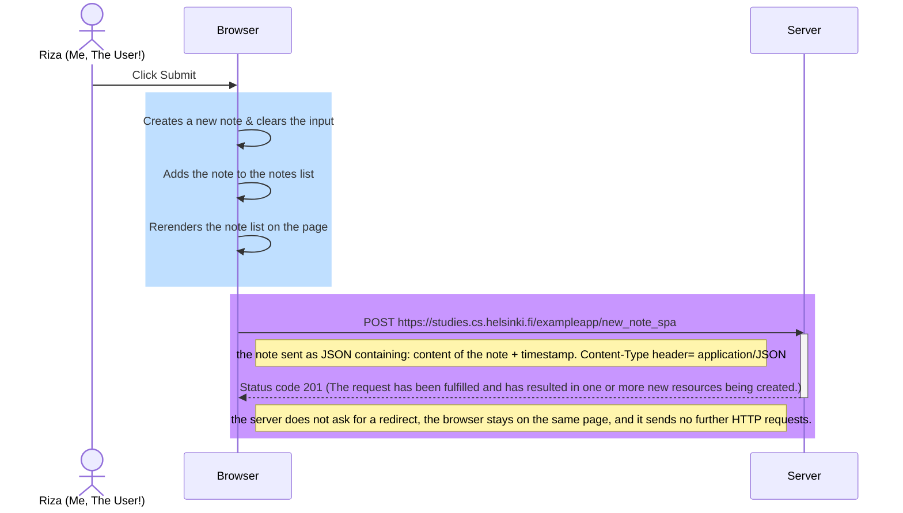

#H1 Submitting a note in the modern SPA notes application

URL: https://studies.cs.helsinki.fi/exampleapp/spa

```mermaid
sequenceDiagram
    Actor r as Riza (Me, The User!)
    participant b as Browser
    participant s as Server

    r->>b: Click Submit
    rect rgb(191, 223, 255)
    b->>b: Creates a new note & clears the input
    b->>b: Adds the note to the notes list
    b->>b: Rerenders the note list on the page
    end


    rect rgb(200, 150, 255)
    b->>s: POST https://studies.cs.helsinki.fi/exampleapp/new_note_spa
    activate s

    Note right of b: the note sent as JSON containing: content of the note + timestamp.  Content-Type header= application/JSON
    s-->>b: Status code 201 (The request has been fulfilled and has resulted in one or more new resources being created.)
     deactivate s
    Note right of b: the server does not ask for a redirect, the browser stays on the same page, and it sends no further HTTP requests.

    end
```
