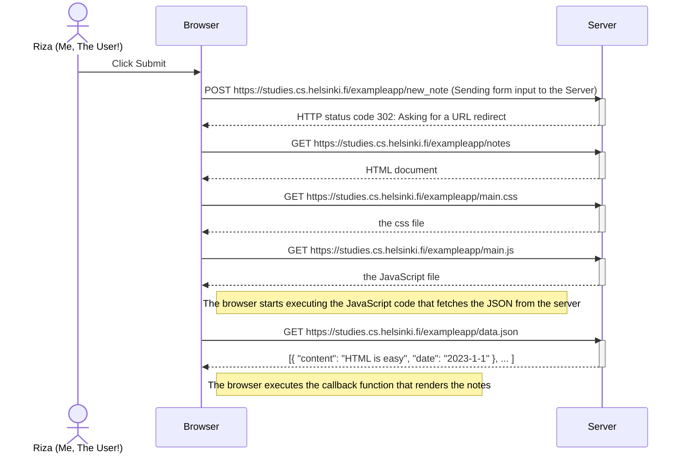

#H1 Submitting a note in the traditional nonSPA notes application

URL: https://studies.cs.helsinki.fi/exampleapp/notes

```mermaid
sequenceDiagram
    Actor r as Riza (Me, The User!)
    participant b as Browser
    participant s as Server

    r->>b: Click Submit
    b->>s: POST https://studies.cs.helsinki.fi/exampleapp/new_note (Sending form input to the Server)
    activate s
    s-->>b: HTTP status code 302: Asking for a URL redirect
    deactivate s

    b->>s: GET https://studies.cs.helsinki.fi/exampleapp/notes
    activate s
    s-->>b: HTML document
    deactivate s

    b->>s: GET https://studies.cs.helsinki.fi/exampleapp/main.css
    activate s
    s-->>b: the css file
    deactivate s

    b->>s: GET https://studies.cs.helsinki.fi/exampleapp/main.js
    activate s
    s-->>b: the JavaScript file
    deactivate s

    Note right of b: The browser starts executing the JavaScript code that fetches the JSON from the server

    b->>s: GET https://studies.cs.helsinki.fi/exampleapp/data.json
    activate s
    s-->>b: [{ "content": "HTML is easy", "date": "2023-1-1" }, ... ]
    deactivate s

    Note right of b: The browser executes the callback function that renders the notes

```
