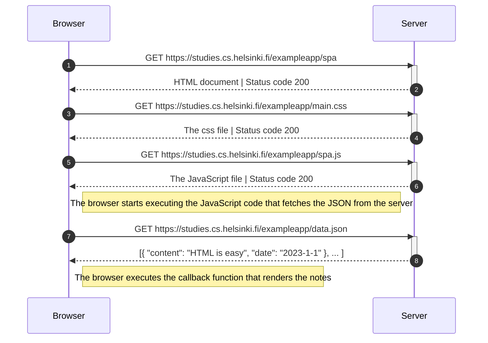

#H1 Loading a SPA containing JavaScript script to render notes

URL: https://studies.cs.helsinki.fi/exampleapp/spa

```mermaid
sequenceDiagram

    participant b as Browser
    participant s as Server

    autonumber
    b->>s: GET https://studies.cs.helsinki.fi/exampleapp/spa
    activate s
    s-->>b: HTML document | Status code 200
    deactivate s

    b->>s: GET https://studies.cs.helsinki.fi/exampleapp/main.css
    activate s
    s-->>b: The css file | Status code 200
    deactivate s

    b->>s: GET https://studies.cs.helsinki.fi/exampleapp/spa.js
    activate s
    s-->>b: The JavaScript file | Status code 200
    deactivate s

    Note right of b: The browser starts executing the JavaScript code that fetches the JSON from the server

    b->>s: GET https://studies.cs.helsinki.fi/exampleapp/data.json
    activate s
    s-->>b: [{ "content": "HTML is easy", "date": "2023-1-1" }, ... ]
    deactivate s

    Note right of b: The browser executes the callback function that renders the notes

```
